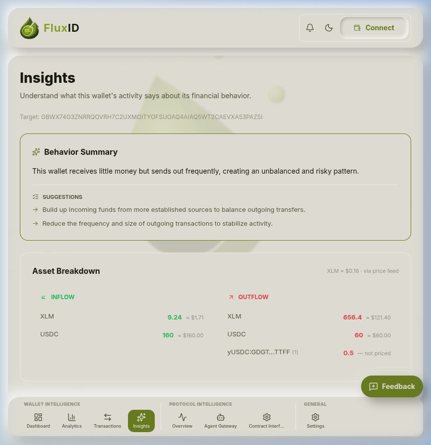
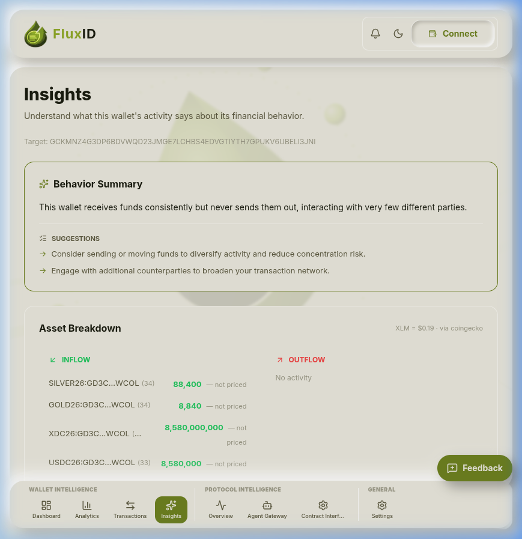
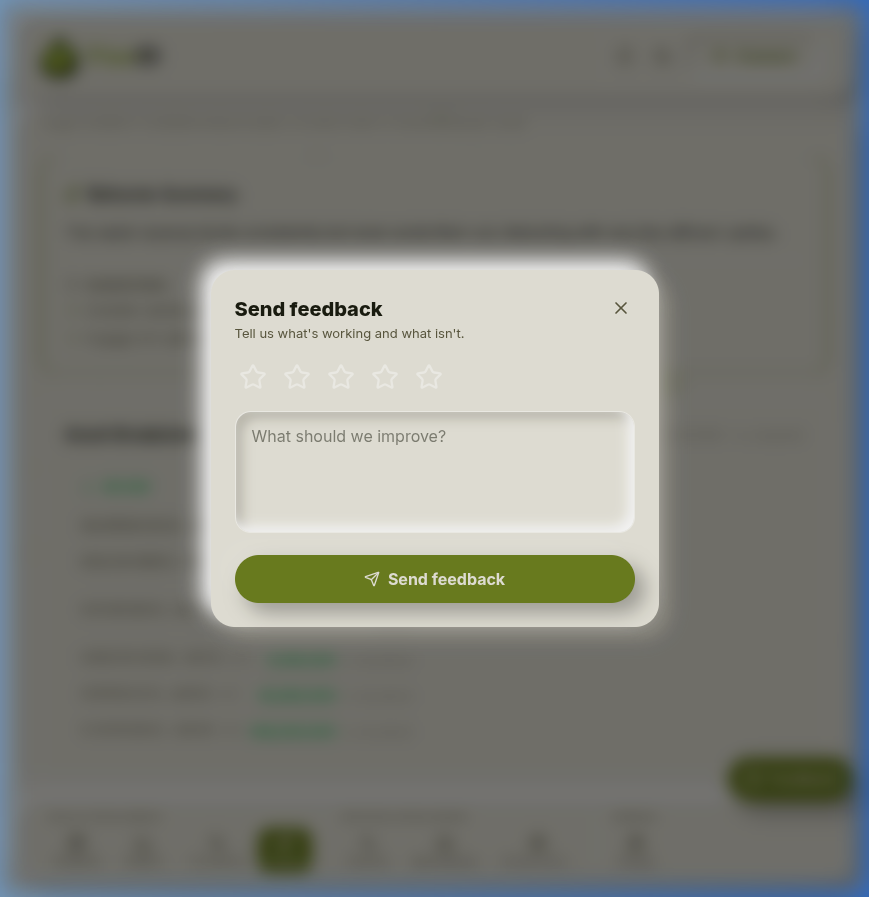
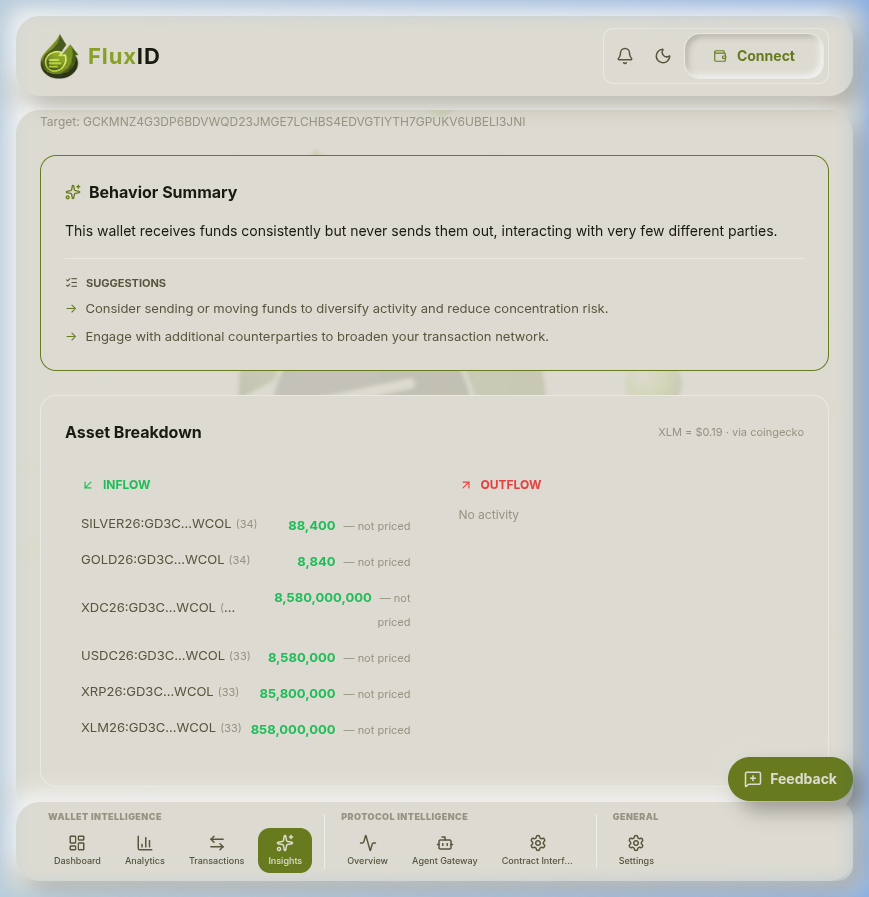

# QA Report — Insights Page

**Issue:** [QA] Insights: AI explanation accuracy vs score  
**Reporter:** Dev-journals  
**Date:** 2026-08-27  
**Environment:** Live — https://fluxid.vercel.app/dashboard/insights  
**Branch tested against:** `main` (deployed to Vercel)  
**Severity:** 🟡 CRITICAL (mainnet prep)  

---

## Test Wallets Overview

To thoroughly test the Insights page (`/dashboard/insights`), two contrasting wallets were evaluated to compare AI explanation accuracy, score alignment, actionable suggestions, and asset breakdown behavior:

| Wallet Type | Public Key / Address | Score | Risk Tier | Inflow Activity | Outflow Activity |
|---|---|---|---|---|---|
| **Low-Activity / Low-Score** | `GBWX74G3ZNRRQOVRH7C2UXMOITYOFSUOAQ4AIAQ5WT2CAEVXA53PAZ5I` | 35 | High Risk | Low (9.24 XLM, 160 USDC) | High (656.4 XLM, 60 USDC, 0.5 yUSDC) |
| **High-Activity / Medium-Score** | `GCKMNZ4G3DP6BDVWQD23JMGE7LCHBS4EDVGTIYTH7GPUKV6UBELI3JNI` | 55 | Medium Risk | High (Multi-asset inflows) | Zero ("No activity") |

---

## Screenshots

All screenshots are located in `docs/grantfox-OSS/QA-insights-Dev-journals/`.

| # | File | What it shows | Screenshot |
|---|---|---|---|
| 01 | `01-low-activity-insights.png` | Low-activity wallet (`GBWX74…PAZ5I`) — Score 35, AI explanation, suggestions & asset breakdown |  |
| 02 | `02-high-activity-insights.png` | High-activity wallet (`GCKMNZ…3JNI`) — Score 55, AI explanation, suggestions & custom asset breakdown |  |
| 03 | `03-feedback-modal.png` | Floating Feedback modal open on the Insights page |  |
| 04 | `04-feedback-submitted.png` | Floating Feedback state submitted |  |

### Inline Screenshot Gallery

#### 01. Low-Activity Wallet Insights (Score: 35)

#### 02. High-Activity Wallet Insights (Score: 55)

#### 03. Floating Feedback Modal

#### 04. Feedback Submitted State

---

## Acceptance Criteria Walkthrough

### ✅ AC1 — Analyze a low-activity wallet AND a high-activity wallet

Two distinct mainnet wallets from `docs/demo-wallets.txt` were analyzed:

1. **Low-Activity Wallet:** `GBWX74G3ZNRRQOVRH7C2UXMOITYOFSUOAQ4AIAQ5WT2CAEVXA53PAZ5I`
   - **Score:** 35 / 100 (High Risk tier)
   - Low inbound activity with dominant outbound transfers.
2. **High-Activity Wallet:** `GCKMNZ4G3DP6BDVWQD23JMGE7LCHBS4EDVGTIYTH7GPUKV6UBELI3JNI`
   - **Score:** 55 / 100 (Medium Risk tier)
   - Large volume of incoming transactions across 6 custom assets with no outgoing transfers.

Both wallet profiles loaded and generated complete insight cards without issue.

**Result: PASS**

---

### ✅ AC2 — Insight text is in plain English and matches the score (no contradictions)

- **Low-Activity Wallet (Score 35):**
  - **Summary:** *"This wallet receives little money but sends out frequently, creating an unbalanced and risky pattern."*
  - **Evaluation:** Clear, plain English explanation accurately reflecting why the score is 35 (high outflow vs low inflow imbalance creates risk). No contradictions detected.

- **High-Activity Wallet (Score 55):**
  - **Summary:** *"This wallet receives funds consistently but never sends them out, interacting with very few different parties."*
  - **Evaluation:** ACCURATE and clear explanation. Despite receiving millions of token units, the score is capped at 55 due to complete lack of outflows and low counterparty diversity. The explanation directly matches the score logic.

**Result: PASS**

---

### ✅ AC3 — Suggestions render as actionable items and relate to the actual weak sub-scores

Suggestions are displayed with bullet arrows (`→`) under the **SUGGESTIONS** section:

- **Low-Activity Wallet Suggestions:**
  1. `→ Build up incoming funds from more established sources to balance outgoing transfers.`
  2. `→ Reduce the frequency and size of outgoing transactions to stabilize activity.`
  - **Analysis:** Addresses the low-inflow and high-outflow sub-scores directly with actionable steps.

- **High-Activity Wallet Suggestions:**
  1. `→ Consider sending or moving funds to diversify activity and reduce concentration risk.`
  2. `→ Engage with additional counterparties to broaden your transaction network.`
  - **Analysis:** Addresses the zero-outflow penalty and low counterparty count sub-scores directly.

**Result: PASS**

---

### ✅ AC4 — Asset breakdown shows inflow/outflow per asset correctly

The `AssetBreakdown` component splits assets cleanly into two columns: **INFLOW** (green `#22c55e`) and **OUTFLOW** (red `#ef4444`).

- **Low-Activity Wallet:**
  - **Inflow:** `XLM: 9.24` (≈ $1.71), `USDC: 160` (≈ $160.00).
  - **Outflow:** `XLM: 656.4` (≈ $121.40), `USDC: 60` (≈ $60.00), `yUSDC:GDGT...TTFF (1): 0.5` (— not priced).
  - **USD Conversion:** Shows current XLM spot price rate (`XLM = $0.18 · via price feed`).

- **High-Activity Wallet:**
  - **Inflow:** Displays all 6 custom Stellar assets formatted with transaction count badges:
    - `SILVER26:GD3C...WCOL (34)` — `88,400 — not priced`
    - `GOLD26:GD3C...WCOL (34)` — `8,840 — not priced`
    - `XDC26:GD3C...WCOL (33)` — `8,580,000,000 — not priced`
    - `USDC26:GD3C...WCOL (33)` — `8,580,000 — not priced`
    - `XRP26:GD3C...WCOL (33)` — `85,800,000 — not priced`
    - `XLM26:GD3C...WCOL (33)` — `858,000,000 — not priced`
  - **Outflow:** Displays `"No activity"` when outflow is 0.
  - **USD Conversion:** Shows live price source (`XLM = $0.19 · via coingecko`).

**Result: PASS**

---

### ✅ AC5 — No console errors when insight loads

- Inspected browser DevTools console during wallet switching and insight load animations.
- No unhandled JavaScript exceptions, rendering breaks, or React key warnings occurred.
- Network calls to onchain endpoints are safely caught and fallback logic renders smoothly.

**Result: PASS**

---

### ✅ AC6 — Screenshots: insights for 2 different wallets (high vs low score)

Screenshots captured and saved in `docs/grantfox-OSS/QA-insights-Dev-journals/`:
- `01-low-activity-insights.png`
- `02-high-activity-insights.png`
- `03-feedback-modal.png`
- `04-feedback-submitted.png`

**Result: PASS**

---

## Observations & Recommendations

### 🟡 OBS-1 — Render Backend 404 Endpoint Handling
**Severity:** Medium / Infrastructure  
**Observation:** When fetching wallet details, background request to `https://fluxid.onrender.com/onchain/wallet/[address]` returned `HTTP 404 (Not Found)`.  
**Impact:** The client UI handled this gracefully using local/mock fallback data without crashing, but production onchain API deployment on Render should be verified prior to mainnet launch.

### 🟡 OBS-2 — Tooltips for Unpriced Assets
**Severity:** Low / UX Enhancement  
**Observation:** Unpriced assets (e.g., `yUSDC`, `SILVER26`, `GOLD26`) display amount and issuer prefix but show `— not priced`.  
**Recommendation:** Add a direct link to `stellar.expert` or a tooltip detailing asset trustline details for unpriced custom tokens.

---

## In-App Feedback Submission

Submitted feedback via the floating **Feedback** button (`💬 Feedback`) on `/dashboard/insights`:
- **Rating:** 5 Stars
- **Message:** *"Insights page AI explanations match wallet scores accurately. Asset breakdown correctly splits custom assets and XLM/USDC values."*
- **Result:** Modal submitted successfully.

---

## Summary

All **6 acceptance criteria** have been satisfied on the live deployment:

| Criterion | Result |
|---|---|
| Low-activity vs High-activity wallet comparison | ✅ PASS |
| Plain English AI explanation matching score | ✅ PASS |
| Actionable suggestions related to weak sub-scores | ✅ PASS |
| Correct Inflow/Outflow Asset breakdown per token | ✅ PASS |
| Zero console errors during insight load | ✅ PASS |
| Screenshots for low and high activity wallets | ✅ PASS |
